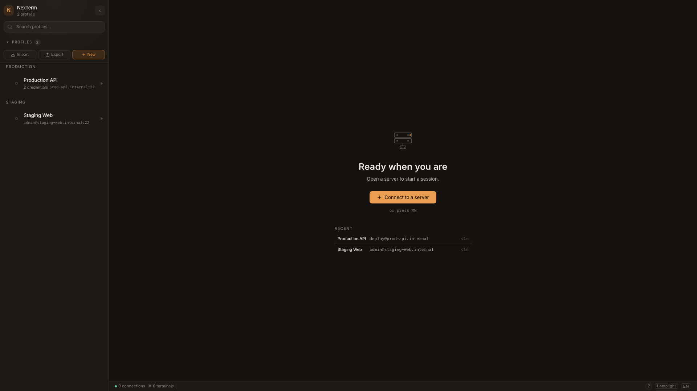
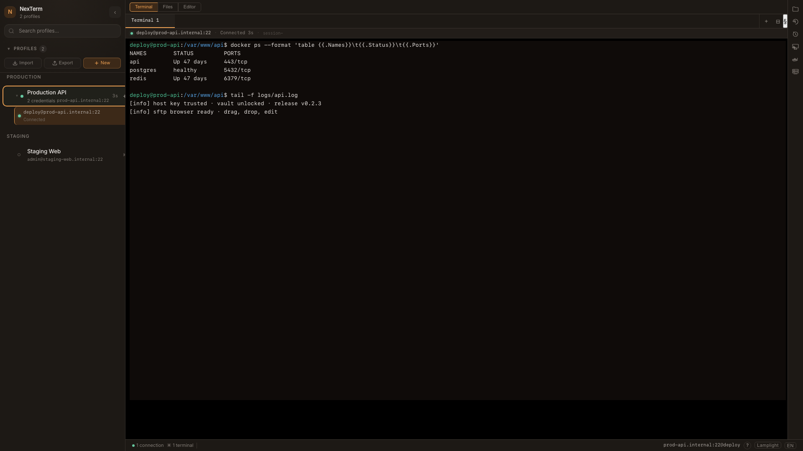
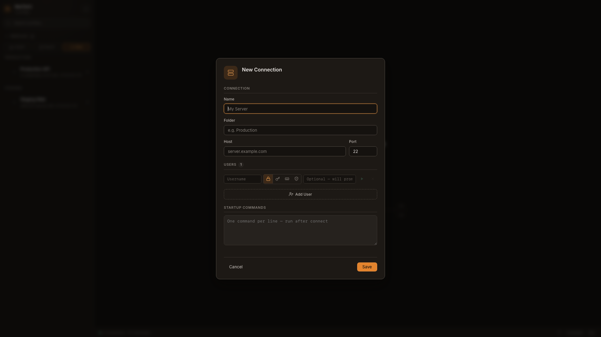
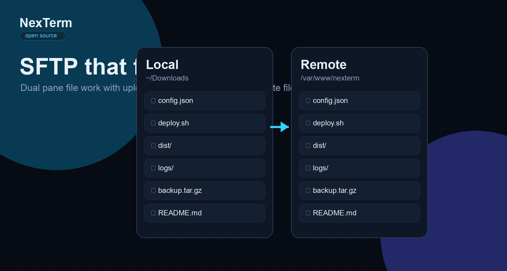

<div align="center">

# NexTerm

### A modern open-source SSH workspace for people who live on servers.

[](LICENSE)
[](https://github.com/JeffersonAlvarez16/nexterm/releases/latest)
[](https://v2.tauri.app)
[](https://www.rust-lang.org)
[](https://react.dev)

**Created and maintained by [Jefferson Alvarez](https://github.com/JeffersonAlvarez16).**

</div>

---

NexTerm is a native desktop SSH client that brings the daily remote-workflow stack into one focused app: terminal sessions, SFTP, encrypted credentials, SSH tunnels, host-key verification and remote operations.

It is built with **Tauri 2**, **Rust**, **React 19** and **TypeScript**, so it stays lighter than Electron-based tools while still feeling like a modern product.

---

## Preview

Screenshots below are captured from the running NexTerm UI with local demo data. They are product captures, not marketing mockups.

<div align="center">

| Workspace | Terminal |
|:---:|:---:|
|  |  |
| Profile editor | SFTP browser |
|  |  |

</div>

---

## Why NexTerm exists

Most SSH tools split your work across terminals, file-transfer clients, password managers and notes. NexTerm gives that workflow one place to live.

- **One server, multiple users:** keep a single host profile and attach root, deploy, admin or personal users with separate credentials.
- **Encrypted credential vault:** AES-256-GCM with Argon2id-derived keys. Credentials are not stored in plain text.
- **Terminal-first workflow:** split panes, search, snippets, command history, input broadcast and GPU rendering fallback.
- **SFTP built into the workflow:** browse, drag, drop, download folders recursively, resolve conflicts and edit local or remote files without leaving your session.
- **Visual SSH tunnels:** create local, remote and dynamic SOCKS5 forwards without memorizing flags.
- **Operations panels:** monitor remote systems and manage Docker containers or Proxmox LXC guests over SSH.
- **Security-first desktop UX:** host-key verification, vault auto-lock, pastejacking protection, hardened local-file handling and single-instance protection.

---

## Features

### Terminal

- xterm.js powered terminal rendering with WebGL acceleration and DOM fallback
- Multiple terminals, split panes and keyboard navigation between panes
- Search/find bar, copy-on-select, smart paste and risky multi-line paste checks
- Snippets with variable prompts and preview-before-execute safeguards
- Optional command history capture and input broadcast for multi-pane workflows

### SFTP and editor

- Full-area SFTP file browser plus terminal-side panel access
- Dual-pane local and remote browsing
- Upload, download, rename, delete and create folders
- Recursive folder download with aggregate progress
- Drag-and-drop transfers in both directions
- Sequential conflict resolution for upload/download batches
- Remote file viewing and local/remote file editing through Rust-backed file commands

### Profiles and credentials

- One profile can hold multiple users
- Password, key, SSH agent and keyboard-interactive/MFA auth flows
- Key-file picker, SSH key generation and ProxyJump/bastion support
- Encrypted vault with master password
- Auto-lock after inactivity and defensive lock after suspend
- Profile folders and startup command confirmation

### SSH operations

- Local, remote and dynamic SOCKS5 tunnels
- Monitoring panels for remote process/system views
- Docker helper actions over SSH
- Proxmox LXC helper actions over SSH
- Host-key trust-on-first-use with change, algorithm and revocation detection

### UI and accessibility

- Theme presets and theme picker
- Accessible dialogs, tablists, labels and focus states
- English and Spanish interface strings

---

## Releases

Latest documented version: **v0.2.3**. See [CHANGELOG.md](CHANGELOG.md) for the real per-release changes.

### Recent releases

| Version | Date | Highlights |
|---|---:|---|
| [v0.2.3](https://github.com/JeffersonAlvarez16/nexterm/releases/tag/v0.2.3) | 2026-06-06 | Hardened local-file handling and release security; bumped app metadata to 0.2.3. |
| [v0.2.2](https://github.com/JeffersonAlvarez16/nexterm/releases/tag/v0.2.2) | 2026-06-05 | Security hardening, terminal split/search/snippet/history/broadcast work, SFTP conflict/full-area/editor flows, SSH auth upgrades, monitoring, Docker and Proxmox panels. |
| 0.2.1 | 2026-04-29 | Workspace snapshots and recursive SFTP folder download. This entry is documented from the release branch/changelog history. |

### Platform support

The release workflow is configured to build macOS Apple Silicon, macOS Intel, Linux x64 and Windows x64 artifacts. Updater artifacts are temporarily disabled until a valid Tauri updater signing key is configured.

| Platform | Release target |
|---|---|
| macOS Apple Silicon | `.dmg` / app bundle |
| macOS Intel | `.dmg` / app bundle |
| Linux x64 | `.deb` + `.rpm` + `.AppImage` |
| Windows x64 | `.msi` + `.exe` |

---

## Install

Download the latest build from GitHub Releases:

[Latest release](https://github.com/JeffersonAlvarez16/nexterm/releases/latest)

> Current builds may be unsigned. On macOS, if Gatekeeper blocks the app, run:
>
> ```bash
> xattr -cr /Applications/NexTerm.app
> ```

---

## Build from source

```bash
# Requirements: Rust stable, Node.js 20+, pnpm and Tauri platform prerequisites

git clone https://github.com/JeffersonAlvarez16/nexterm.git
cd nexterm
pnpm install
pnpm tauri dev
pnpm tauri build
```

Run checks:

```bash
pnpm exec tsc --noEmit
pnpm test
cd src-tauri && cargo test
```

---

## Tech stack

| Layer | Technology |
|---|---|
| Desktop runtime | Tauri 2 |
| Backend | Rust |
| SSH/SFTP | russh + russh-sftp |
| Frontend | React 19 + TypeScript |
| State | Zustand |
| Bundler | Vite |
| Terminal | xterm.js |
| Crypto | AES-GCM + Argon2id |
| CI/CD | GitHub Actions |

---

## Security

NexTerm handles credentials and remote access, so security is part of the product, not an afterthought.

- Master password is never stored.
- Vault data is encrypted at rest.
- Host-key verification helps detect MITM risk, including changed algorithms and revoked keys.
- Credentials are not sent before host-key verification succeeds.
- Clipboard and paste flows include safety affordances.
- Unsafe SFTP names are rejected during recursive downloads.
- Local file editing avoids arbitrary renderer-to-filesystem write IPC.
- Local tunnel binds default to loopback.
- Release builds use frozen dependency installs before publishing.

Found a vulnerability? Report it privately through [GitHub Security Advisories](https://github.com/JeffersonAlvarez16/nexterm/security/advisories).

---

## Contributing

Contributions are welcome.

1. Open an issue or discussion with the problem you want to solve.
2. Fork the repository.
3. Create a focused branch.
4. Keep commits reviewable.
5. Open a pull request with context, screenshots when relevant and test evidence.

---

## License

MIT, see [LICENSE](LICENSE).

---

<div align="center">

Built by [Jefferson Alvarez](https://github.com/JeffersonAlvarez16) for developers, sysadmins and homelab builders.

</div>
