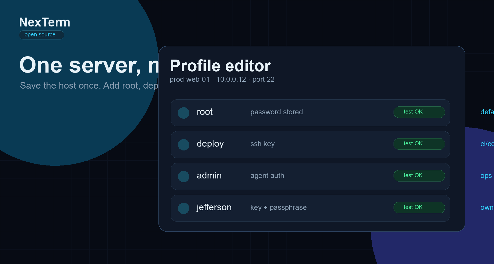
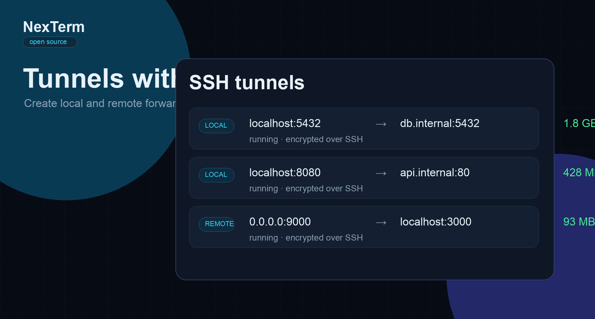

<div align="center">

# NexTerm

### A modern open-source SSH workspace for people who live on servers.

[](LICENSE)
[](https://github.com/JeffersonAlvarez16/nexterm/releases)
[](https://v2.tauri.app)
[](https://www.rust-lang.org)
[](https://react.dev)

**Created and maintained by [Jefferson Alvarez](https://github.com/JeffersonAlvarez16).**

</div>

---

NexTerm is a native desktop SSH client that brings the daily remote-workflow stack into one focused app: terminal sessions, SFTP, encrypted credentials, SSH tunnels, host-key verification and remote operations.

It is built with **Tauri 2**, **Rust**, **React 19** and **TypeScript**, so it stays lighter than Electron-based tools while still feeling like a modern product.

---

## Preview

<div align="center">

| Terminal | Profiles |
|:---:|:---:|
|  |  |
| SFTP | Tunnels |
|  |  |

</div>

---

## Why NexTerm exists

Most SSH tools split your work across terminals, file-transfer clients, password managers and notes. NexTerm gives that workflow one place to live.

- **One server, multiple users:** keep a single host profile and attach root, deploy, admin or personal users with separate credentials.
- **Encrypted credential vault:** AES-256-GCM with Argon2id-derived keys. Credentials are not stored in plain text.
- **SFTP built into the workflow:** browse, upload, download, search and manage files without leaving your session.
- **Visual SSH tunnels:** create local and remote forwards without memorizing flags.
- **Security-first desktop UX:** host-key verification, vault auto-lock, pastejacking protection, hardened local-file handling and single-instance protection.

---

## Features

### Terminal

- xterm.js powered terminal rendering
- Multiple terminals per SSH session
- Search, themes, Unicode and font support
- Paste safety checks for risky multi-line commands

### SFTP

- Dual-pane local and remote file browser
- Upload, download, rename, delete and create folders
- Conflict handling for file transfers
- Remote file viewing and remote editor support

### Profiles and credentials

- One profile can hold multiple users
- Password, key and agent-based auth flows
- Encrypted vault with master password
- Auto-lock after inactivity and defensive lock after suspend

### SSH operations

- Local and remote tunnels
- Monitoring panels for remote process/system views
- Docker and Proxmox helper actions over SSH
- Host-key trust-on-first-use with change detection

### Release and platform support

- macOS Apple Silicon supported today
- Linux and Windows builds are planned through the release workflow
- Auto-update artifacts are configured through Tauri updater support

---

## Install

Download the latest build from GitHub Releases:

| Platform | Status |
|---|---|
| macOS Apple Silicon | [Latest release](https://github.com/JeffersonAlvarez16/nexterm/releases/latest) |
| macOS Intel | Planned |
| Linux | Planned |
| Windows | Planned |

> Current builds may be unsigned. On macOS, if Gatekeeper blocks the app, run:
>
> ```bash
> xattr -cr /Applications/NexTerm.app
> ```

---

## Build from source

```bash
# Requirements: Rust stable, Node.js 22+, pnpm and Tauri platform prerequisites

git clone https://github.com/JeffersonAlvarez16/nexterm.git
cd nexterm
pnpm install
pnpm tauri dev
pnpm tauri build
```

Run checks:

```bash
pnpm exec tsc --noEmit
pnpm test
cd src-tauri && cargo test
```

---

## Tech stack

| Layer | Technology |
|---|---|
| Desktop runtime | Tauri 2 |
| Backend | Rust |
| SSH/SFTP | russh + russh-sftp |
| Frontend | React 19 + TypeScript |
| State | Zustand |
| Bundler | Vite |
| Terminal | xterm.js |
| Crypto | AES-GCM + Argon2id |
| CI/CD | GitHub Actions |

---

## Security

NexTerm handles credentials and remote access, so security is part of the product, not an afterthought.

- Master password is never stored.
- Vault data is encrypted at rest.
- Host-key verification helps detect MITM risk.
- Clipboard and paste flows include safety affordances.
- Local file editing avoids arbitrary renderer-to-filesystem write IPC.
- Release builds use frozen dependency installs before signing and publishing.

Found a vulnerability? Report it privately through [GitHub Security Advisories](https://github.com/JeffersonAlvarez16/nexterm/security/advisories).

---

## Contributing

Contributions are welcome.

1. Open an issue or discussion with the problem you want to solve.
2. Fork the repository.
3. Create a focused branch.
4. Keep commits reviewable.
5. Open a pull request with context, screenshots when relevant and test evidence.

---

## License

MIT, see [LICENSE](LICENSE).

---

<div align="center">

Built by [Jefferson Alvarez](https://github.com/JeffersonAlvarez16) for developers, sysadmins and homelab builders.

</div>
